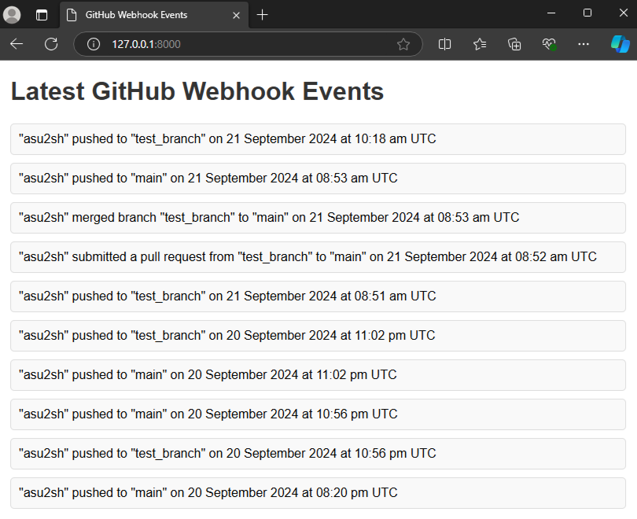

# Webhook Receiver for GitHub Actions

This repository contains the implementation of a webhook endpoint to receive GitHub events from another repository (action-repo). It listens to the following events: **Push**, **Pull Request**, and **Merge**. These events are stored in a MongoDB database and can be viewed via a polling UI that refreshes every 15 seconds.

## Features
- Receives GitHub webhook events for **Push**, **Pull Request**, and **Merge** actions.
- Stores event data (author, branch, action, and timestamp) in MongoDB.
- Provides a simple UI to display the latest 10 events, which updates every 15 seconds.
- Clean and minimalistic UI for better readability.

## Production Link
You can view the deployed version of the application here: [Production Link](https://your-production-link.com).
Feel free to modify the [action-repo](https://github.com/asu2sh/action-repo) to test different GitHub actions. Changes made in the action repository will be reflected in the production site in real-time!

## How to Run Locally

### Prerequisites
- Python 3.8+
- MongoDB instance (local or remote)
- [ngrok](https://ngrok.com/) (for testing webhooks locally)

### Steps
1. **Clone the repository**:
    ```bash
    git clone https://github.com/asu2sh/webhook-repo.git
    cd webhook-repo
    ```

2. **Set up the virtual environment**:
    ```bash
    python -m venv venv
    source venv/bin/activate  # On Windows: venv\Scripts\activate
    ```

3. **Install dependencies**:
    ```bash
    pip install -r requirements.txt
    ```

4. **Create a `.env` file**:
    Set the following environment variables in a `.env` file (if applicable):
    ```plaintext
    MONGO_DATABASE_NAME=<mongo-db-name>
    MONGO_COLLECTION_NAME=<mongo-collection-name>
    # If using remote mongo DB:
    MONGO_REMOTE_URI="mongodb+srv://<username>:<password>@cluster0.i7pzb.mongodb.net/?retryWrites=true&w=majority&appName=Cluster0"
    ```

5. **Run the FastAPI server**:
    ```bash
    fastapi dev main.py
    ```

6. **Expose your local server to the internet (using ngrok)**:
    In a new terminal window, run:
    ```bash
    ngrok http 8000
    ```
    This will give you a URL like `https://<your-ngrok-id>.ngrok.io`. Copy this URL for the next step.

7. **Set up the webhook on GitHub**:
    Go to the settings of your `action-repo` on GitHub:
    - Navigate to **Settings** > **Webhooks** > **Add webhook**.
    - Paste the ngrok URL followed by `/webhook`, e.g., `https://<your-ngrok-id>.ngrok.io/webhook`.
    - Select **Content-Type** as `application/json`.
    - Choose the events **Push**, **Pull Request**, and **Merge**.

8. **Access the UI**:
    Visit `http://localhost:8000` in your browser to see the latest events.

## Testing Locally
You can test the webhook by pushing to your `action-repo` and watching the data being updated in the UI.

## Access the UI
Here is a screenshot of the minimalistic UI displaying recent webhook events:



## Application Flow
Here is the complete flow of the application:


## Why FastAPI?
Since we need to frequently pull data (poll MongoDB every 15 seconds) and handle webhook requests efficiently, FastAPI is the better choice. It provides asynchronous I/O for better performance, built-in data validation, and faster development with minimal boilerplate.

## License
This project is licensed under the MIT License.
